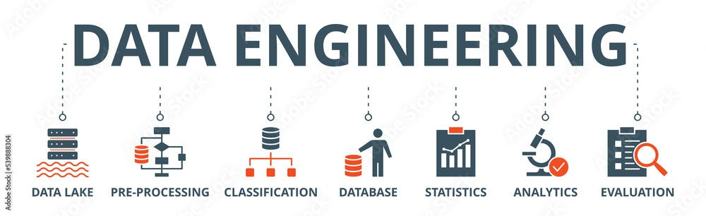

# Data Engineering Roadmap for Arabic Speakers

This repository provides a structured learning path with essential resources for aspiring data engineers. The goal is to help you acquire the necessary skills to become a Junior Data Engineer by covering the core technologies and concepts commonly used in the field.

## 📚 Core Skills & Resources

This roadmap includes the following key areas of data engineering:

### 1. [Hadoop Resources](hadoop/hadoop-resources.md)
Hadoop is a framework for distributed storage and processing of large data sets across clusters of computers. In this section, you'll find curated content to help you understand Hadoop's core components and usage.

### 2. [Linux Resources](linux/linux-resources.md)
Linux is a vital operating system in data engineering. Mastering Linux commands is essential for managing servers, files, and tasks in a data engineering environment.

### 3. [Git & GitHub Resources](git-github/git-github-resources.md)
Git is a version control system, and GitHub is a collaborative platform. Learning these tools is critical for managing code and collaborating with other engineers on data projects.

### 4. [Python Resources](python/python-resources.md)
Python is the go-to language for data engineers due to its simplicity and powerful libraries for data manipulation and analysis. This section offers a selection of resources to help you master Python programming.

### 5. [SQL Resources](sql/sql-resources.md)
Structured Query Language (SQL) is the backbone of data manipulation. It’s a crucial skill for querying databases, building ETL pipelines, and analyzing data.

### 6. [Docker Resources](docker/docker-resources.md)
Docker is essential for creating isolated, reproducible environments. Learning Docker enables you to containerize applications and manage environments efficiently.

### 7. [Database Resources](database/database-resources.md)
Understanding databases, including ACID properties, partitioning, sharding, indexing, and how data is stored, is key to becoming a competent data engineer.

### 8. [Data Warehousing Resources](dwh/dwh-resources.md)
Data warehousing is crucial for managing large datasets and enabling efficient reporting and analysis. Learn about data warehousing concepts, schemas, and modeling techniques in this section.

### 9. [Airflow Resources](airflow/airflow-resources.md)
Apache Airflow is a powerful tool for automating workflows. This section covers the basics of Airflow and how to schedule and monitor data pipelines.

## 🔗 How to Use This Roadmap

1. Start with the **Linux** section if you’re unfamiliar with operating system commands.
2. Move on to **Git & GitHub** to understand version control and collaboration.
3. Follow with **Python** and **SQL** to develop your core data engineering skills.
4. Dive into more specialized technologies like **Hadoop**, **Docker**, and **Airflow** as you progress.

Each section contains a mix of free and paid resources, from articles to videos, ensuring a well-rounded learning experience.

## 🎯 Goal

By following this roadmap, you will gain the fundamental knowledge needed to apply for Junior Data Engineer roles, equipped with both practical and theoretical expertise in the most in-demand technologies.

---

Good luck on your journey to becoming a Data Engineer! 🚀

